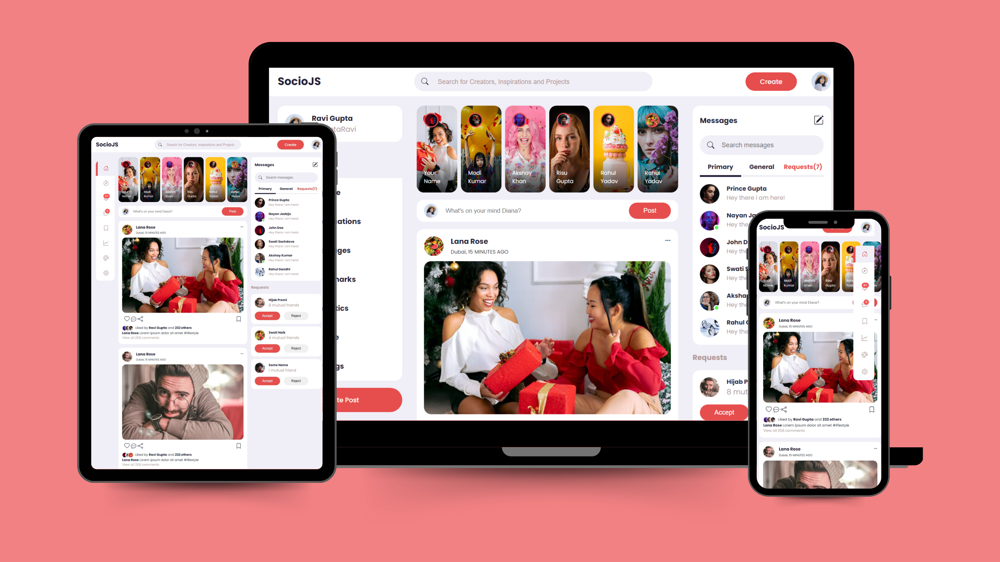
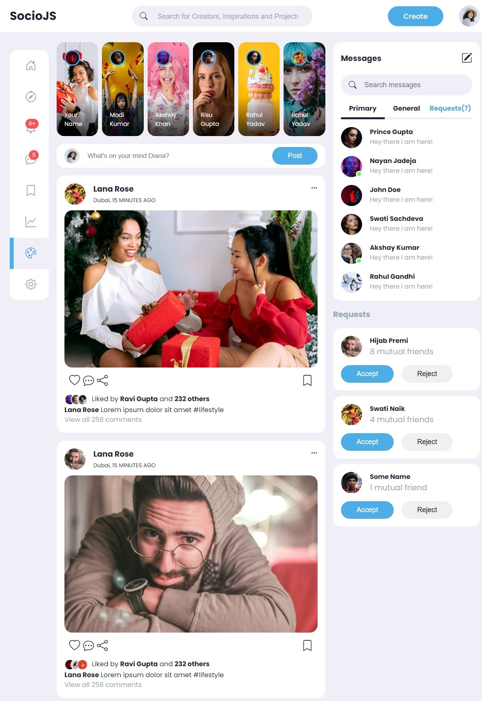
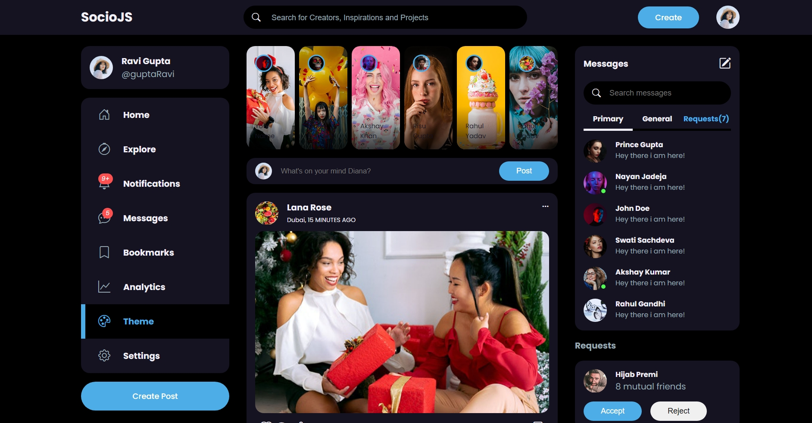
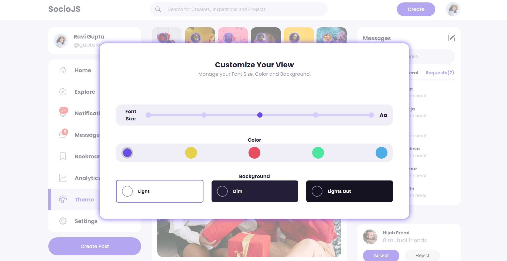
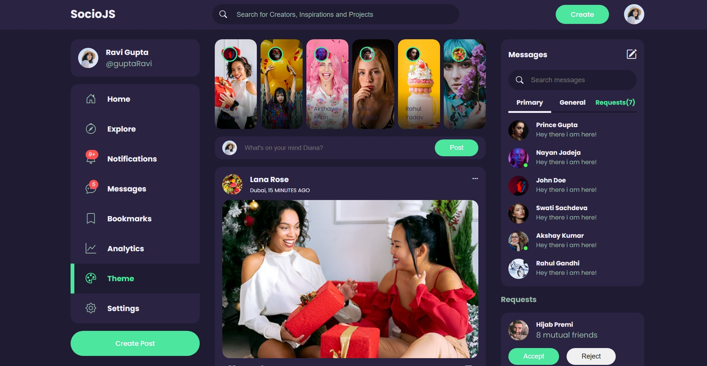

# Social Media App 🌐

Welcome to the **Social Media App** project! This is a simple yet elegant social media application that allows users to interact, post updates, and connect with friends. Dive into the code, explore the features, and see the live demo to get a full experience of what this app offers.



## 🚀 Live Demo

Check out the live demo of the application on GitHub Pages: [Live Demo](https://gupta-ravi.github.io/JsSocioApp/)

## 🎥 YouTube Tutorial

For a detailed walkthrough of the project setup and features, watch YouTube tutorial: [Watch on YouTube](https://youtu.be/AiFfDjmd0jU?si=eNfQBe1lrxL-AZP2)


## 🛠 Features

- **Responsive Design:** Adapts to any screen size for a seamless user experience.
- **Modern UI/UX:** Clean and intuitive interface for easy navigation.
- **Interactive Posts:** Create, read, update, and delete posts with ease.
- **Real-Time Updates:** See the latest updates from your friends in real-time.
- **Customizable Profiles:** Personalize your profile with pictures and bio.

## 📸 Screenshots






## 📝 Usage

To use this project, follow these steps:

1. **Clone the repository:**
    ```sh
    git clone https://github.com/Gupta-Ravi/JsSocioApp.git
    ```
2. **Navigate to the project directory:**
    ```sh
    cd JsSocioApp
    ```
3. **Open `index.html` in your preferred browser:**
    ```sh
    open index.html
    ```

## 🎨 Customization

You can customize the application by modifying the following files:

- `index.html`: Update the HTML structure and content.
- `style.css`: Change the styles to match your desired design.
- `script.js`: Add or modify JavaScript functionality.

## 💻 Technologies Used

- **HTML5**: For the structure of the application.
- **CSS3**: For styling and layout.
- **JavaScript**: For interactivity and dynamic content.

## 📚 Learn More

To learn more about the technologies used in this project, check out the following resources:

- [HTML5 Documentation](https://developer.mozilla.org/en-US/docs/Web/Guide/HTML/HTML5)
- [CSS3 Documentation](https://developer.mozilla.org/en-US/docs/Web/CSS/CSS3)
- [JavaScript Documentation](https://developer.mozilla.org/en-US/docs/Web/JavaScript)

## 🤝 Contributing

We welcome contributions to enhance this project! To contribute, follow these steps:

1. Fork the repository.
2. Create a new branch (`git checkout -b feature/your-feature`).
3. Make your changes and commit them (`git commit -am 'Add your feature'`).
4. Push to the branch (`git push origin feature/your-feature`).
5. Open a Pull Request.

## 📄 License

This project is licensed under the MIT License. See the [LICENSE]

---

Happy coding! 🎉

Feel free to reach out if you have any questions or need further assistance. 

---

**Maintainers**: [Ravi Gupta](https://github.com/Gupta-Ravi)

For more projects, visit my [GitHub Profile](https://github.com/Gupta-Ravi).


